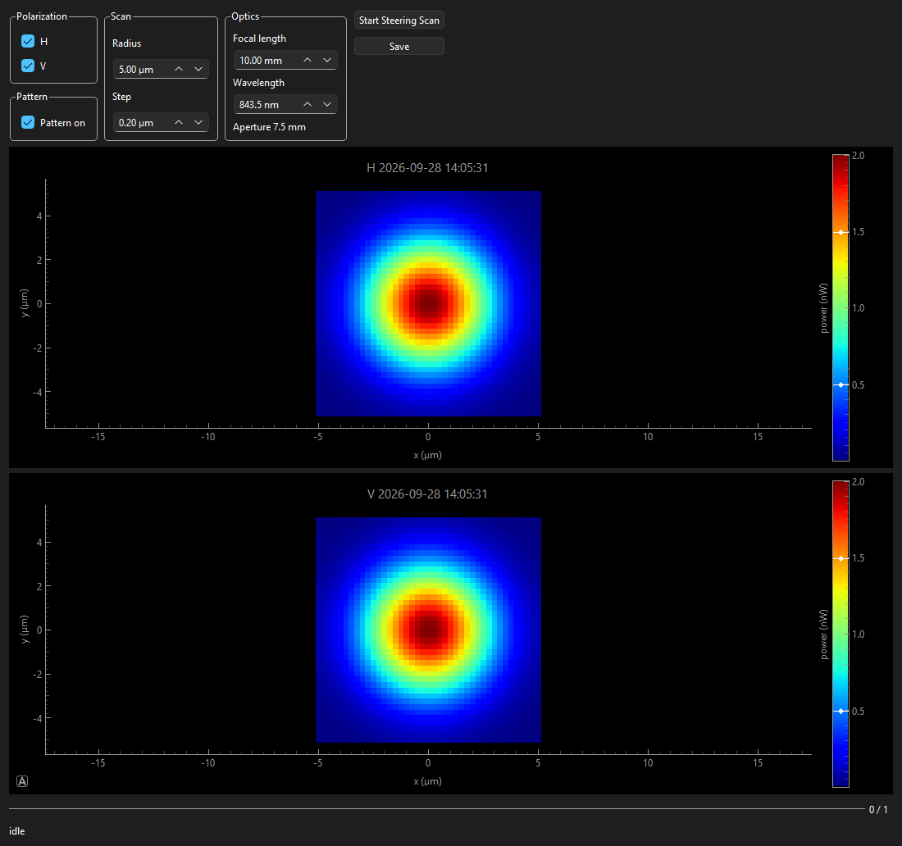

# BeamSteering

ModeLab tilt scan of coupled power around the current Zernike state. The SLM, Zernike engine, and power meter are passed in. This package does not open hardware.

## Package layout

```
BeamSteering/
├── engine.py            ZernikeSteering scan thread and save
├── grid.py              micrometres to Zernike tilt
├── ui/                  PySide6 panel and pyqtgraph maps
├── scripts/release.py   git-tag release automation
├── pyproject.toml       package metadata + version
└── CHANGELOG.md
```

## Canonical imports

```python
from BeamSteering import ZernikeSteering
from BeamSteering.ui import SteeringWidget  # requires the gui extra
```

## Quick start

```python
steering = ZernikeSteering(slm, zernike, powermeter)
steering.set_saving_path(r"C:\path\to\parent")
steering.scan("H", pattern_enabled=True)
# steering.stop()
folder = steering.save()
```

`scan` walks a square window in the focal plane and writes power into a map for H, V, or both. `save` creates `steering_znk_pattern_{on|off|mixed}_{timestamp}/` with `znk_{pol}.json`, `{pol}_scan.npz`, and `{pol}_scan.png`. The JSON is the Zernike coefficient file taken when that polarization started, plus both SLM pixel centers.

## GUI

`SteeringWidget` takes the engine and the SLM, Zernike, and power-meter widgets. It locks those panels for the scan and polls the maps.

<!-- gui-screenshot -->

<!-- /gui-screenshot -->

## Installation

### From GitHub (tagged release)

```bash
pip install "BeamSteering[gui] @ git+https://github.com/MarKo7s/BeamSteering.git@v1.0.0"
```

That install also pulls the pinned engines: `slm` v0.3.0, `zernikes` v1.1.0, `powermeters` v0.2.0, and `cameras` v0.2.1.

### Local development (editable install)

```bash
pip install -e ".[gui,notebooks]"
```

### Conda environment

Conda provides **Python + pip only**. Install numpy and PySide6 with **pip** so conda Qt DLLs do not conflict with PySide6 on Windows.

```bash
conda create -n beamsteering python=3.11 pip -y
conda activate beamsteering
pip install -e ".[gui,notebooks]"
```

## Developer notes

### Versioning

The package version is defined in **one place only**: `pyproject.toml` → `[project].version`.

Do **not** edit `__init__.py` on each release. `BeamSteering.__version__` is read from pip metadata after install.

Use [semantic versioning](https://semver.org/): `MAJOR.MINOR.PATCH`.

### Releasing a new version

1. Add `## [X.Y.Z]` at the top of `CHANGELOG.md`.
2. Set `version = "X.Y.Z"` in `pyproject.toml`.
3. Commit.
4. `python scripts/release.py --from-changelog`
